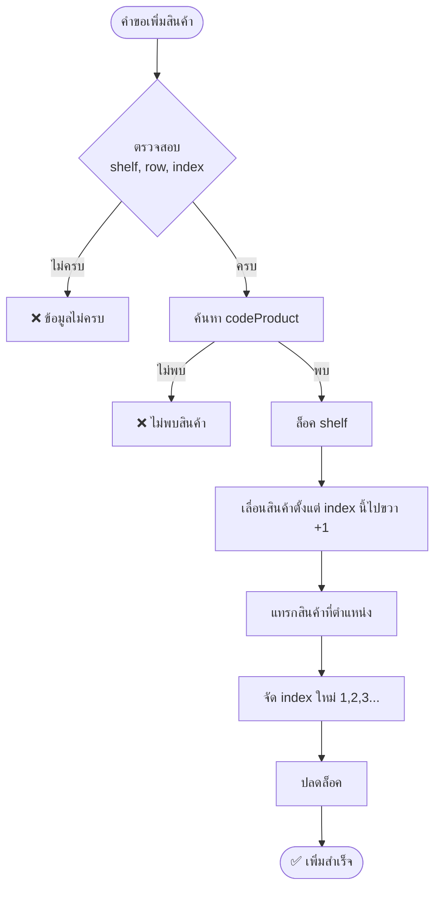
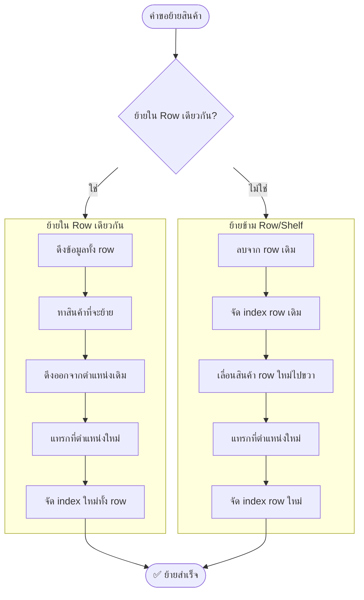
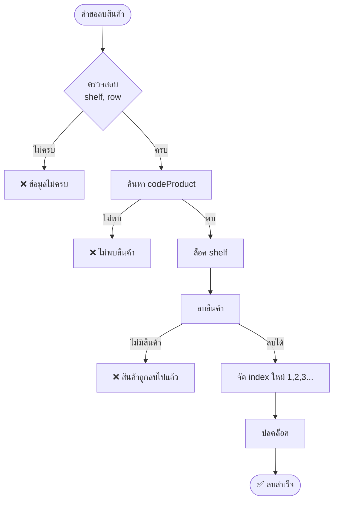
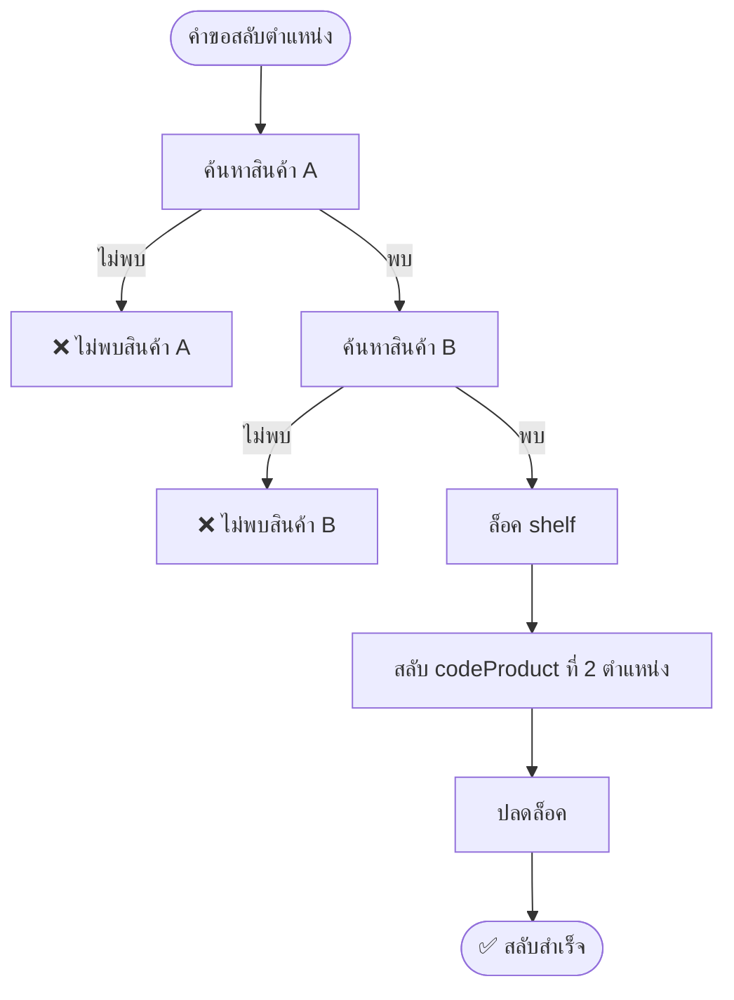
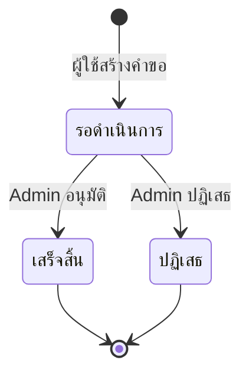

# คำขอเปลี่ยนแปลง POG - Diagram เงื่อนไขการทำงาน

## ภาพรวมระบบ

```mermaid
flowchart TB
    subgraph ผู้ใช้["👤 ผู้ใช้ (Mobile App)"]
        SCAN[สแกนบาร์โค้ด]
        SELECT[เลือก Action]
    end

    SCAN --> SELECT
    SELECT --> ADD_REQ[เพิ่มสินค้า]
    SELECT --> MOVE_REQ[ย้ายสินค้า]
    SELECT --> DELETE_REQ[ลบสินค้า]
    SELECT --> SWAP_REQ[สลับตำแหน่ง]

    subgraph เซิร์ฟเวอร์["🖥️ Server"]
        PENDING[(รอดำเนินการ)]
        APPROVE{Admin อนุมัติ}
    end

    ADD_REQ --> PENDING
    MOVE_REQ --> PENDING
    DELETE_REQ --> PENDING
    SWAP_REQ --> PENDING

    PENDING --> APPROVE
    APPROVE -->|ทีละรายการ| SINGLE
    APPROVE -->|หลายรายการ| BULK

    subgraph SINGLE["อนุมัติทีละรายการ"]
        S1[ดำเนินการตาม action]
    end

    subgraph BULK["อนุมัติหลายรายการ พร้อม Offset Tracking"]
        B1[1. ลบทั้งหมด]
        B2[2. จัด index ใหม่]
        B3[3. เพิ่มสินค้า]
        B4[4. ย้ายสินค้า]
        B5[5. สลับตำแหน่ง]
    end

    B1 --> B2 --> B3 --> B4 --> B5
```

---

## การเพิ่มสินค้า (ADD)



### ตัวอย่าง: เพิ่มหลายตัวที่ตำแหน่งเดียวกัน

```
สินค้า A ส่งคำขอ → W1/Row1/Index1 (ขอก่อน)
สินค้า B ส่งคำขอ → W1/Row1/Index1 (ขอทีหลัง)

ผลลัพธ์หลังอนุมัติ:
- A = index 1 (ขอก่อน ได้ก่อน)
- B = index 2 (offset +1)
```

---

## การย้ายสินค้า (MOVE)



### ตัวอย่าง 1: ย้ายใน Row เดียวกัน

```
ก่อน: A, B, C, D, E (index 1,2,3,4,5)

คำขอ: B → index 4

หลัง: A, C, D, B, E (index 1,2,3,4,5)
```

### ตัวอย่าง 2: ย้ายข้าม Row

```
ก่อน:
  W1/Row1: A, B, C, D, E (index 1-5)
  W1/Row2: G, H, I, J, K (index 1-5)

คำขอ: B → W1/Row2/index 3

หลัง:
  W1/Row1: A, C, D, E (index 1-4) ✅ จัด index ใหม่
  W1/Row2: G, H, B, I, J, K (index 1-6) ✅ แทรกและจัด index ใหม่
```

---

## การลบสินค้า (DELETE)



### ตัวอย่าง: ลบสินค้า

```
ก่อน: A, B, C, D, E (index 1,2,3,4,5)

คำขอ: ลบ C

หลัง: A, B, D, E (index 1,2,3,4) ✅ จัด index ใหม่
```

---

## การสลับตำแหน่ง (SWAP)



### ตัวอย่าง: สลับตำแหน่ง

```
ก่อน: A, B, C, D, E (index 1,2,3,4,5)

คำขอ: สลับ B กับ D

หลัง: A, D, C, B, E (index 1,2,3,4,5)
```

---

## ลำดับการอนุมัติแบบ Bulk

```mermaid
flowchart LR
    subgraph ลำดับ["ลำดับการประมวลผล"]
        D[1. ลบ DELETE]
        R[2. Re-index]
        A[3. เพิ่ม ADD]
        M[4. ย้าย MOVE]
        S[5. สลับ SWAP]
    end
    
    D --> R --> A --> M --> S
```

> **หมายเหตุ:** ทุก action จะเรียงตามลำดับ `createdAt` (ขอก่อน ทำก่อน)

---

## ตารางสรุป Edge Cases

| สถานการณ์ | การจัดการ | ความเสี่ยง |
|----------|----------|-----------|
| เพิ่มหลายตัวที่ตำแหน่งเดียวกัน | ✅ Offset tracking | ต่ำ |
| ย้ายหลายตัวข้าม row | ✅ Offset tracking | ต่ำ |
| ย้ายหลายตัวใน row เดียว | ⚠️ อาจมี conflict | ปานกลาง |
| เพิ่ม + ย้ายใน row เดียวกัน | ⚠️ Offset แยกกัน | ปานกลาง |
| อนุมัติพร้อมกันหลาย admin | ⚠️ Lock per shelf | ปานกลาง |
| สินค้าถูกลบก่อนอนุมัติ | ✅ แจ้ง Error | ต่ำ |

---

## สถานะคำขอ


